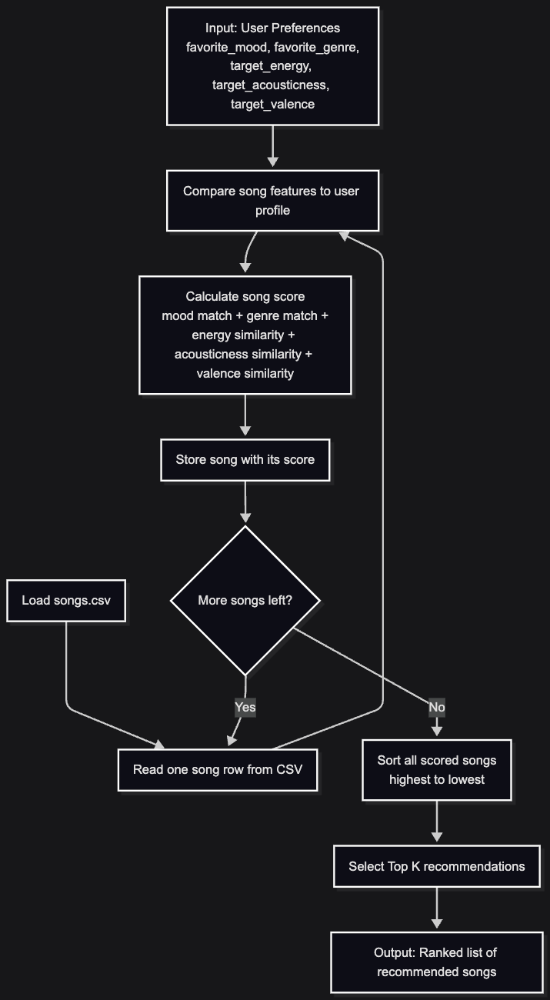
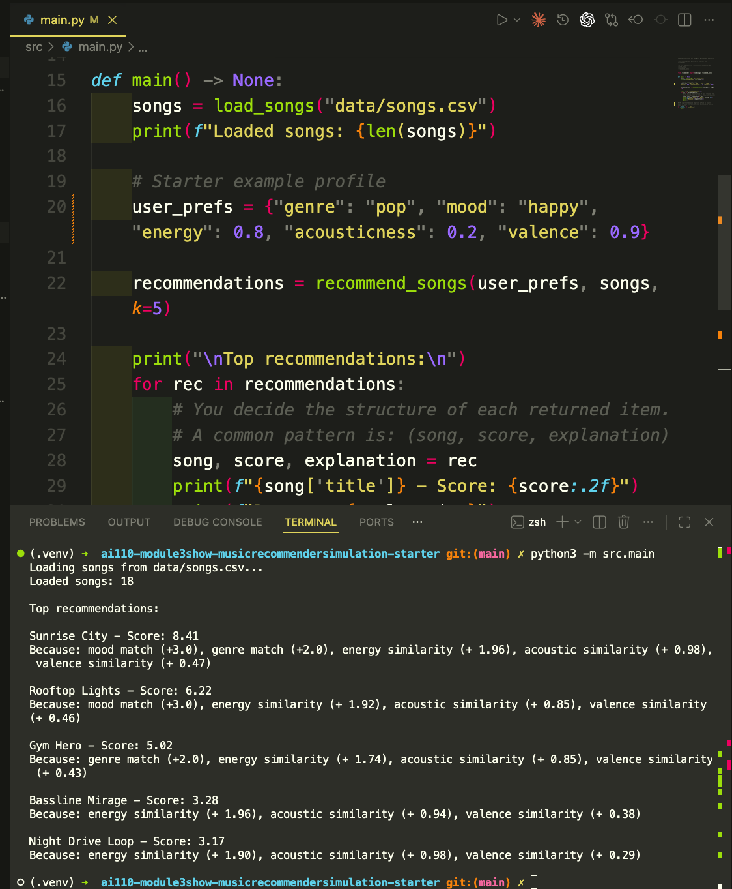
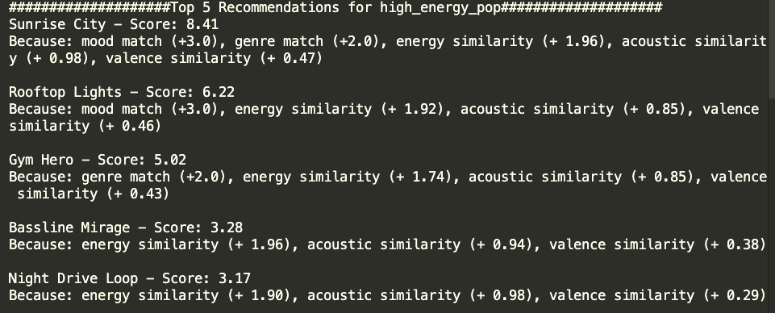
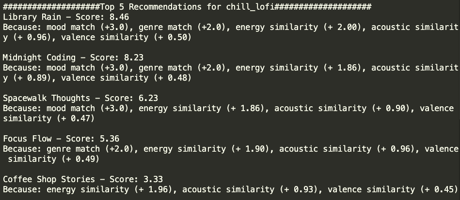
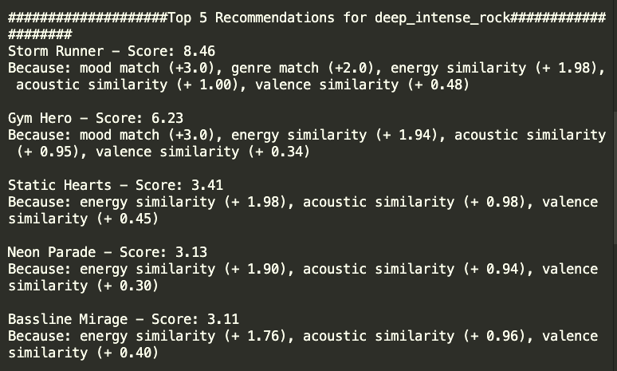
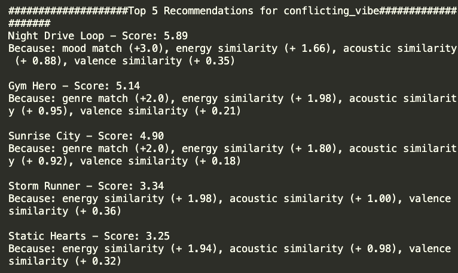
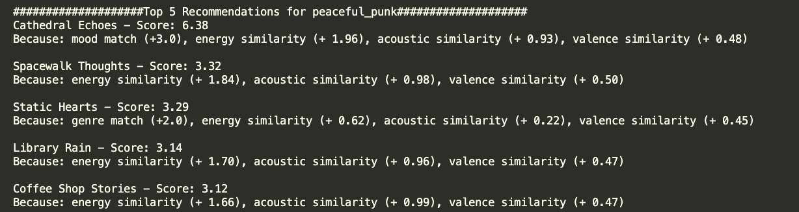

# 🎵 Music Recommender Simulation

## Project Summary

In this project you will build and explain a small music recommender system.

Your goal is to:

- Represent songs and a user "taste profile" as data
- Design a scoring rule that turns that data into recommendations
- Evaluate what your system gets right and wrong
- Reflect on how this mirrors real world AI recommenders

This version of the project simulates a simple content-based music recommender that suggests songs based on a user's preferred vibe. It compares each song to a user taste profile using weighted features such as mood, genre, and energy, then ranks songs by how closely they match. The system is designed to be easy to explain, so each recommendation can be traced back to the features that contributed most to its score.

---

## How The System Works

What features does each `Song` use in your system?

Each song uses both category labels and numerical audio features. The main features are `genre`, `mood`, `energy`, `acousticness`, and `valence`. I treat mood as the main signal for vibe, genre as the style signal, energy as the intensity signal, acousticness as the organic versus electronic texture signal, and valence as the emotional positivity signal.

What information does your `UserProfile` store?

The user profile stores the user's preferred genre, preferred mood, and target values for the numerical vibe features I chose to use, especially energy, acousticness, and valence. These preferences create a simple taste profile that the recommender can compare against each song in the catalog.

How does your `Recommender` compute a score for each song?

The recommender uses a weighted scoring rule. My finalized algorithm recipe is:

- `+3.0` points if the song's mood matches the user's favorite mood
- `+2.0` points if the song's genre matches the user's favorite genre
- `+2.0 * (1 - abs(song.energy - user.target_energy))`
- `+1.0 * (1 - abs(song.acousticness - user.target_acousticness))`
- `+0.5 * (1 - abs(song.valence - user.target_valence))`

This recipe makes mood the strongest signal because the project is centered on matching a listener's vibe. Genre still matters, but it acts more like a style preference. For numerical features like energy, acousticness, and valence, the system rewards songs that are closer to the user's target values instead of simply favoring higher numbers.

How do you choose which songs to recommend?

After scoring every song, the recommender ranks the songs from highest score to lowest score. It then returns the top `k` songs as the recommendations. This means the system first uses a scoring rule to judge one song at a time, then uses a ranking rule to choose the best overall list.

What biases or limitations do you expect from this system?

This system might over-prioritize mood and genre labels, which could cause it to miss songs from other genres that still match the user's overall vibe. It may also favor songs that are close to the chosen numerical targets and ignore other important qualities, such as lyrics, vocals, cultural context, or songs that blend multiple moods at once.

---

## Visual Results

Part 1: Recommender flowchart



Part 2: Terminal output with one starter example profile



Part 3: Terminal output for five different user profiles

High-Energy Pop



Chill Lofi



Deep Intense Rock



Conflicting Vibe



Peaceful Punk



---

## Getting Started

### Setup

1. Create a virtual environment (optional but recommended):

   ```bash
   python3 -m venv .venv
   source .venv/bin/activate      # Mac or Linux
   .venv\Scripts\activate         # Windows

   ```

2. Install dependencies

```bash
python3 -m pip install -r requirements.txt
```

3. Run the app:

```bash
python3 -m src.main
```

### Running Tests

Run the starter tests with:

```bash
python3 -m pytest
```

You can add more tests in `tests/test_recommender.py`.

---

## Experiments You Tried

I tested the system's sensitivity by doubling the weight on energy, changing the energy similarity contribution from `2.0 * similarity` to `4.0 * similarity`. This made the recommender much more intensity-focused. Across profiles like `high_energy_pop`, `deep_intense_rock`, and `conflicting_vibe`, songs with similar energy levels rose in the rankings even when they did not match the user's preferred genre. The clearest example was the `peaceful_punk` profile, where calm low-energy songs outranked the actual punk track because their energy values were much closer to the user's target.

This change made the recommendations different more than it made them more accurate. In some cases it improved the vibe match by surfacing songs with a similar intensity, but it also made the system drift away from the user's stated style preferences. Overall, the experiment showed that energy is a powerful feature, but if it is weighted too heavily, the recommender becomes less genre-aware and less precise.

---

## 7. `model_card_template.md`

This starter template content is now fully answered in [model_card.md](model_card.md). See that file for the completed model card.

```

```
