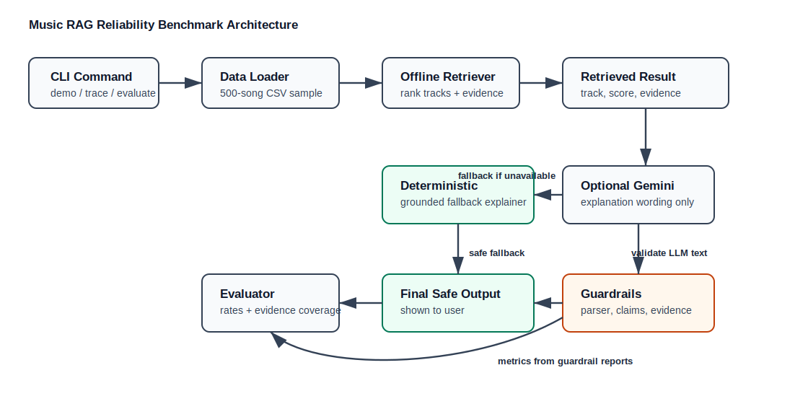

# Music RAG Reliability Benchmark

## Summary

This project extends my original **Music Recommender Simulation** from the earlier course modules. The original system used an 18-song CSV and a hand-written weighted scoring rule to recommend songs from a user's mood, genre, energy, acousticness, and valence preferences.

The extended version turns that baseline into an applied AI reliability project. It adds offline RAG-style retrieval over a real Spotify-style 500-song sample, grounded explanations, optional Gemini explanation generation, guardrails, deterministic fallback behavior, and an evaluator that measures explanation reliability.

Video walkthrough: **TODO: paste Loom or unlisted YouTube link here before submission**

## What Changed From The Base Project

- Kept the original 18-song mood recommender in `src/recommender.py` as the baseline.
- Added real Spotify-style CSV loading in `src/data_loader.py`.
- Added offline retrieval in `src/retriever.py`; retrieval is the source of truth.
- Added deterministic grounded explanations in `src/explainer.py`.
- Added optional Gemini wording in `src/llm_explainer.py`.
- Added validation guardrails and fallback explanations in `src/guardrails.py`.
- Added reliability metrics in `src/evaluator.py`.
- Added a deterministic 500-row Hugging Face dataset sample in `data/spotify_tracks_sample_500.csv`.

## Architecture



The system does not ask Gemini to choose songs. Retrieval ranks tracks first using genre and audio-feature similarity. Gemini is only allowed to rewrite explanations, and guardrails reject unsupported claims like lyrics, vocals, fan reactions, or chart status.

## Dataset

The real-data path uses a deterministic 500-row sample from the Hugging Face Spotify Tracks Dataset by `maharshipandya`. The sample was created with:

```bash
python3 scripts/create_spotify_sample.py
```

The script keeps only the columns required by the loader:

```text
track_name, artists, album_name, track_genre, popularity,
danceability, energy, acousticness, valence, tempo
```

## Setup

```bash
python3 -m venv .venv
source .venv/bin/activate
python3 -m pip install -r requirements.txt
```

Optional Gemini setup:

```bash
export GEMINI_API_KEY="your-key-here"
```

The project still runs without a Gemini key. If the key or SDK is unavailable, it uses deterministic fallback explanations.

## Run The System

Run the end-to-end RAG demo:

```bash
python3 -m src.main demo
```

Show one retrieval and guardrail trace:

```bash
python3 -m src.main trace
```

Run reliability evaluation:

```bash
python3 -m src.main evaluate
```

Run tests:

```bash
python3 -m pytest -q
```

Current verified result:

```text
42 passed
```

## Sample Outputs

Demo output shows retrieval over the 500-song sample:

```text
RAG-grounded music recommendation demo
Catalog size: 500
1. Ishqam by Mika Singh;Ali Quli Mirza
   Genre: pop
   Score: 6.31
   Evidence:
   - genre matches preferred genre 'pop' (+2.00)
   - energy closeness: 0.84 vs target 0.80 (+1.92)
```

Trace output shows guardrail fallback:

```text
Gemini mode: simulated unsafe raw response for reliability demo
Raw response: {"explanation": "This track has emotional lyrics and rich vocals."}
Used LLM output: False
Fallback reason: Gemini explanation failed guardrails
Guardrail unsupported terms: ['lyrics', 'vocals']
Final safe explanation: Ishqam by Mika Singh;Ali Quli Mirza is recommended because...
```

Evaluation output summarizes reliability:

```text
Evaluation cases: 3
Unsupported claim rate: 0.33
Fallback rate: 0.67
Format failure rate: 0.33
Global evidence coverage: 1.00
```

## Reliability Design

The reliability layer checks that explanations are grounded in retrieval evidence.

Measured metrics:

- `unsupported_claim_rate`: how often raw LLM-style output contains unsupported terms.
- `fallback_rate`: how often the system replaces unsafe or malformed output.
- `format_failure_rate`: how often raw output cannot be parsed as valid JSON.
- `global_evidence_coverage`: how much required retrieval evidence is present in final safe outputs.

The evaluator intentionally includes one safe response, one unsupported-claim response, and one malformed response. This makes the guardrail behavior visible without requiring a live Gemini call during grading.

## Stretch Features

This project includes two stretch-feature candidates:

- **RAG Enhancement:** The original 18-song recommender was extended with offline retrieval over a deterministic 500-song Spotify-style dataset sample. Retrieval produces evidence strings that are used by explanations, guardrails, traces, and evaluator metrics.
- **Test Harness / Evaluation Script:** `src/evaluator.py` and `python3 -m src.main evaluate` run predefined reliability cases and print unsupported-claim rate, fallback rate, format failure rate, and global evidence coverage.

## Design Decisions

- Retrieval is offline and deterministic so recommendations are reproducible.
- Gemini is only a wording layer, not the recommender.
- The original 18-song recommender remains separate from the real-data RAG path.
- The real dataset is sampled deterministically instead of taking the first 500 rows.
- Fallback explanations are deterministic so unsafe or malformed LLM output never breaks the demo.

## Limitations

The system uses metadata and audio features, not lyrics or audio waveforms. It cannot know personal taste, cultural context, vocal style, or lyrical meaning. The 500-song sample is useful for demonstration, but it is still a small slice of a much larger music catalog.

## Reflection

This project taught me that applied AI reliability is mostly about boundaries: deciding what the model is allowed to know, what it must prove with evidence, and what should happen when it fails. The biggest improvement over the baseline is that recommendations now come with retriever evidence and guardrail-checked explanations.

I used AI as a pair-programming partner to design the RAG pipeline, tests, guardrails, and evaluator. A helpful AI suggestion was to keep Gemini as an explanation layer instead of letting it choose recommendations. A flawed suggestion was initially spending time polishing explanation wording before the evaluator and CLI were complete; under the deadline, the higher-value move was to finish the measurable reliability path first.
